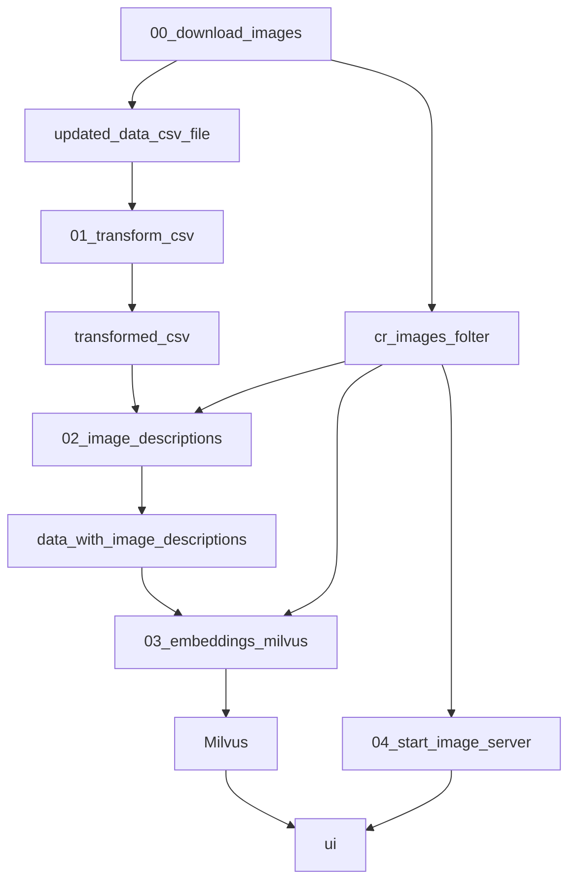

## Dependencias

- python 3.11
- requirements.txt

## Configuración del entorno de ejecución

Se asume que los datos del resto se encuentran, descargados, descomprimidos y localizados en la raíz del repositorio

## Esquema de la solución

## Orden de ejecución

- **00_download_images.py**: descarga todas las imágenes del campo cr_imágenes asociado a cada claim.Las imágenes se guardan en la carpeta `cr_images`, donde a cada imagen se le asigna un uuid que es referenciado en el registro original de los datos proporcionados.**WARNING: TARDA EN EJECUTARSE**

- **01_transform_csv.py**: genera un nuevo archivo csv, derivado del original, que contiene un subconjunto de campos y ciertos campos renombrados.

- **02_image_descriptions.ipynb**: genera un nuevo archivo csv, que contiene una columna extra, en la cual se almacena una descripción generada a partir de un LLM.**WARNING: TARDA EN EJECUTARSE**

- **03_embeddings milvus.ipnyb**: se encarga de inicializar la BD Vectorial (MilvusDB), generar los embeddings de texto, los embeddings de imagen e insertar dicha información en la BD (junto con algunos metadatos extra).**WARNING: TARDA >1h EN EJECUTARSE**

- **04_start_image_server.sh**: levanta un simple servidor http, que permite servir las imágenes descargadas, de cara a ser consumidas posteriormente por la UI desarrollada.

- **ui.pi**: interfaz de usuario que permite ejecutar el RAG, esta realizada con streamlit y se ejecuta con el comando `streamlit run ui.py`. La interfaz tiene algunas funcionalidades como:
    - generar múltiples queries a partir de la query original del usuario. Estas queries son las que realmente se usan para consultar el almacén vectorial. Los resultados de cara query son combinados y re-ordenados para construir el resultado final.
    - proporcionar los resultados de búsqueda obtenidos a un LLM para que use como contexto, junto con las imágenes asociadas
    - proporcionar ciertas explicabilidad sobre la decisión tomada por el modelo
    - capacidades de logging para controlar las operaciones de fondo realizadas

## Demos

### Elizabeth II

#### Imagen

Expected Search Results: 
- Claim 1 - Newschecker (India)
- Claim 2 - Boom Live (India)

##### Texto 

    la reina elizabeth II ha alimentado a niños como si se tratasen de animales?

Expected Search Results:
- Claim 1 - Alt News (India)
- Claim 2 - Alt News (India)
- Claim 3 - ICIR Nigeria (Unknown)

##### COMBINADO

Aparecen los 5 claims y la clasificación final tiene más certeza. Ahora aparece como False y precviamente como partially False

## Como responde esta solución a los resto de evaluación

Se asignarán puntos en base a los siguientes criterios de evaluación.

- 30 - Soporte multimodal en la recuperación de información: busca documentos candidatos atendiendo a la información del texto y de la imagen
    - la solución permite búscar por texto para recuperar el texto de claims similares e imágenes (de las cuales se compaara también la query con la descripción de la imagen)
    - se puede buscar proporcionando únicamente una imágen, lo que proporcionará todos los claims que contengan una imagen con un embedding similar al proporcionado
    - se puede hacer una búsqueda combinando texto e imagen, que en una única acción, combina los resultados de los puntos anteriores

- 20 - Desempeño: se lanzan 5 preguntas y se asignan los puntos en la medida que estas respuestas incluyen información de alguno de los contenidos filtrados
    - dado un prompt de un usuario, este se envía a un LLM que reformula el prompt y proporciona 5 prompts diferentes, que son los que usarán para para realizar las búsquedas por texto. Los resultos de las 5 búsquedas se combinan y ordenan de cara a proporcionar un único resultado

- 15 - Soporte multimodal en los elementos de búsqueda: permite incluir como entrada una imagen
    - como se ha comentado en el primer punto, está soportado

- 10 - Evaluación: se implementa alguna métrica de evaluación válida para la recuperación y/o la generación
    - A través de la base de datos vectorial utilizada ([Milvus](https://milvus.io/)), los textos e imágenes se filtran de forma que tengan un score de similitud superior a un umbral. Para los textos se utiliza la métrica Inner product (IP) y para las imágenes la Euclidean distance (L2), [ambass proporcionados por Milvus](https://milvus.io/docs/metric.md?tab=floating).

- 10 - Estrategia de reranking de documentos candidatos: incorporar algún modelo o estrategia para rerankear los candidatos
    - En el código de la interfaz, se obtienen los scores de similitud de diferentes búsquedas y se combinan en un único score por resultado único.

-  5 - Combinación de documentos en la respuesta: usar (si procede) más de un documento candidato para generar la respuesta
    - se utilizan todos los documentos que superan los criterios de similitud.

-  5 - Trazabilidad: se incluye algún método o herramienta de trazabilidad para depurar, monitorizar o auditar el uso de LLMs controlar el gasto de la solución en términos de uso de servicios externos o de tiempo
    - en la interfaz realizadas, se muestra las búsquedas de texto realizadas, los resultados obtenidos de la búsqueda, el resultado generado en base a ellos y una explicación.

-  5 - Control de la respuesta: el sistema responde que no tiene suficiente información para responder si no encuentra documentos relevantes en el espacio de búsqueda
    -  Se emite un mensaje genérico cuando ningún resultado de búsqueda supera los criterios mínimos de similitud
